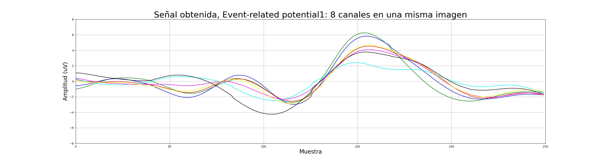

# TRABAJO FINAL INTEGRADOR
## Análisis exploratorio de datos.
### Especialización en ciencia de datos ITBA  

Docente:   
*Rodrigo Ramele | pedro@muttdata.ai* <- Corregir el mail  
  
Estudiante:      
*Alexander Chavez | achavezmontano@itba.edu.ar*   
  
##### *(16/Dic/2022/1130h)*  

  
  

## Intro.
La esclerosis lateral amiotrófica o ELA, es una enfermedad degenerativa de las neuronas en el cerebro, el tronco cerebral y la médula espinal que controlan el movimiento de los músculos voluntarios. En la ELA, las células nerviosas (neuronas) motoras se desgastan o mueren y ya no pueden enviar mensajes a los músculos. Con el tiempo, esto lleva a debilitamiento muscular, espasmos e incapacidad para mover los brazos, las piernas y el cuerpo. La afección empeora lentamente. Cuando los músculos en la zona torácica dejan de trabajar, se vuelve difícil o imposible respirar.  
  
En pacientes con ELA de etapas intermedias y avanzadas, es necesario el uso de dispositivos tecnológicos para la comunicación, como el P300 Speller.  

De forma paralela, es necesario explicar qué es una señal P300.  
La palabra evocado es clave: en medicina, refiere a una actividad que puede ser detectada sincrónicamente después de una cantidad específica de tiempo después del inicio de un estímulo. Si accidentalmente acercás un dedo a una vela, no. Si estamos a la espera de que un computador nos dé una señal visual y nos la da, en nuestro cerebro ocurre un evento de éste tipo. En términos médicos *es una actividad inducida*.  
  

    
[La onda P300 es entonces, una señal en el cerebro con amplitud positiva relacionada con eventos.](https://pubmed.ncbi.nlm.nih.gov/1464675/)   
¿Cuáles son ésos eventos que ya están estudiados y verificados?  
Para éste caso, el más comúnmente provocado bajo el paradigma de "oddball" o "bicho raro":
El sujeto, en éste caso el paciente, detecta un estímulo "objetivo" ocasional en un tren regular de estímulos estándar.  
La onda P300 solo ocurre si el sujeto participa activamente en la tarea de detectar los objetivos.  
Su amplitud varía con la improbabilidad de los objetivos.  
Su latencia varía con la dificultad de discriminar el estímulo objetivo de los estímulos estándar.  
Una latencia pico típica cuando un sujeto adulto joven hace una discriminación simple es de 300 ms.  
En pacientes con capacidad cognitiva disminuida, el P300 es más pequeño y más tardío que en sujetos normales de la misma edad.  
  
Se desconoce el origen intracerebral de la onda P300 y su papel en la cognición no se comprende con claridad.  
El P300 puede tener múltiples generadores intracerebrales, con el hipocampo y varias áreas de asociación de la neocorteza contribuyendo al potencial registrado en el cuero cabelludo.  
La onda P300 puede representar la transferencia de información a la conciencia, un proceso que involucra muchas regiones diferentes del cerebro.

Voy a meter una gráfica general.  
Y voy a contar que, para poderla estudiar, hay que desarmarla en varias partes.  
Una es el ERP.  
Otra son los puntos de estímulo.  
BLA BLA BLA.  

Luego un párrafo del instrumento, el P300 Speller.  
De esto hay info que ya tengo con la de la Distrital, algunos videos y texto.  
  
## Los datasets.  
Son tres grupos de datasets: el *ERPTemplate.mat.*, el grupo de los 8 archivos que conforman el *P300-Dataset* y el grupo de los *p300-subject-XX.mat*.  
  
Cada uno de ellos contiene uno o varios archivos .mat. Por practicidad [se encuentran todos en la carpeta *dataset*](dataset/)  
  
### 1.El *ERPTemplate.mat*.
BLA BLA BLA    
  
  
  
### 2. El grupo de los 8 archivos que conforman el *P300-Dataset*.  

Dataset obtenido de las P300 de ocho **sujetos sanos**.  
Cabe resaltar que, en pacientes con capacidad cognitiva disminuida,  
el P300 es más pequeño y más tardío que en sujetos normales de la misma edad.  

Los archivos son P300SXX.mat.  

Este conjunto de datos se produjo utilizando el estándar 6x6 Donchin y Farewell P300 Speller Matrix, con un ISI de 0,125 ms.  
  
**(ACÁ HAY QUE PASAR LA CITA DEL PAPER DONDE ESTÁ EL ESTÁNDAR)**  

Hay 7 palabras con 5 letras cada una. Hay 10 secuencias de intensificación por letra.  
El procedimiento original usaba 3 palabras para el entrenamiento y trataba de decodificar las 4 palabras restantes para la prueba. 

Intente decodificar la palabra deletreada directamente desde la matriz EEG.  
Hay 7 palabras de 5 letras cada una.  
Cada letra está compuesta por 120 estímulos de la matriz P300, 6 filas y 6 columnas, diez veces cada una.  
El objetivo es decodificar las palabras deletreadas de las últimas 20 letras (4 palabras).  
Dado que el ISI es muy bajo, es difícil adquirir buenos rendimientos.  

[Descripción mas en detalle del dataset](a_analisis_P300XX.ipynb) 

Fuente -> [Kaggle](https://www.kaggle.com/datasets/rramele/p300samplingdataset?resource=download)
Éste dataset fue producido por el CiC, Universidad ITBA, Buenos Aires, Argentina.

### 3. El grupo de los *p300-subject-XX.mat*.  

  **===========================================**  
  *De acá en adelante es guia*  
  **===========================================**  

Esto es por si el readme es largo
* [Instalación y puesta en marcha del ambiente](#Pasos-para-instalar)

## Acerca de
  
Alexander Chavez | [LinkedIn](https://www.linkedin.com/in/alexchavez1980/) 

  
  
